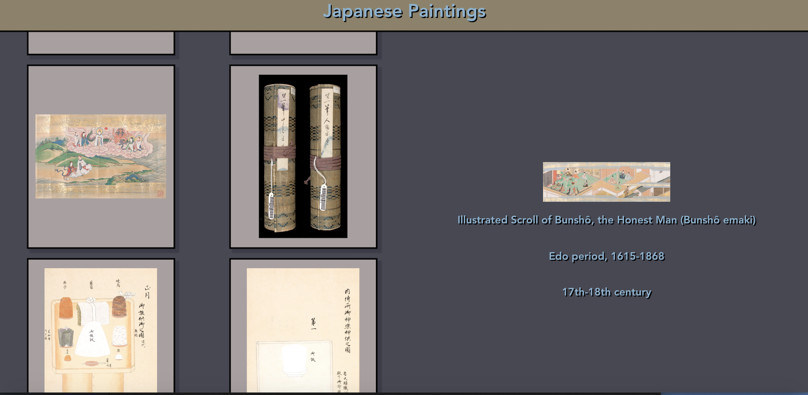

## Gallery
Displays the Harvard Museum collection of Japanese Paintings. This is a first exploration into the Vue Framework.

### Links
- [vue-art-gallery](https://vue-art-gallery.herokuapp.com/) live on Heroku

### Technologies Used

- Vue

### APIs Used
- Harvard Museum API

### Screenshots

##### Gallery

### Next Steps
Additional enhancements will include:
- Sort paintings by date and period

### Set Up
#### Front-end

Clone the repo

Run `npm install` from the root directory

Run `npm run start` and visit localhost:8080 in your browser

### Test Driven Development
Gallery uses Jest for testing

Run with `npm test` in the root directory on the Front-End

